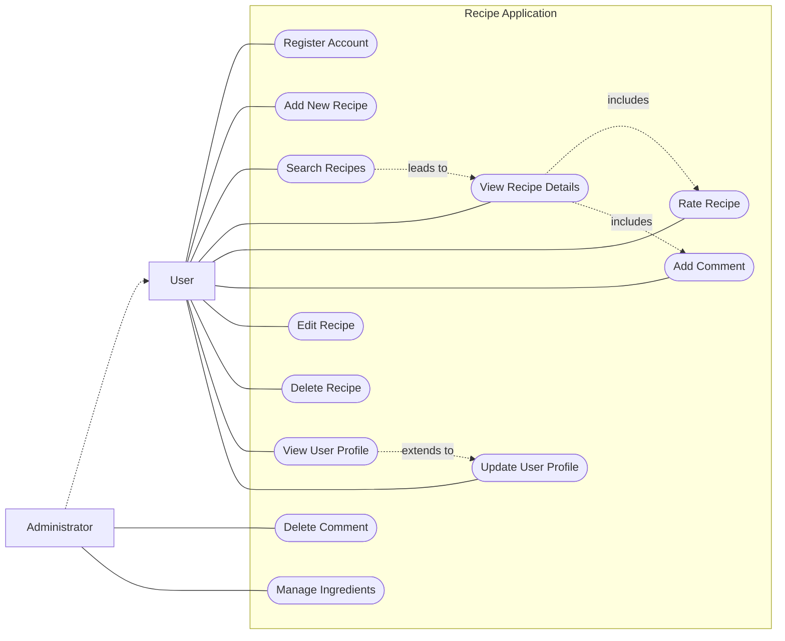
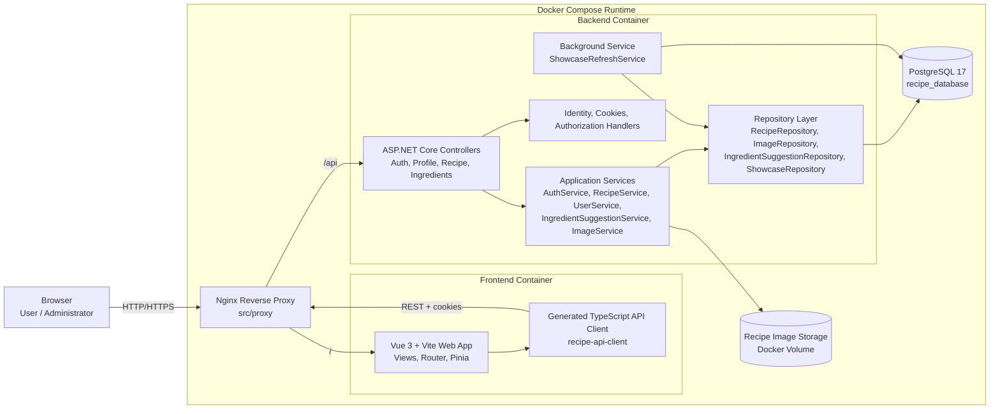

# System Diagrams

This page collects high-level diagrams for the recipe application based on the documented use cases in this repository and the current implementation in `src/`.

## Use Case Diagram

The diagram below summarizes the main user-facing and administrator-facing interactions currently described in the use case documents.

### Notes

- `Administrator` is modeled as a specialized `User`.
- Rating and commenting happen from the recipe details page, so they are shown as related to `View Recipe Details`.
- `Delete Comment` is restricted to administrators according to [011.md](./011.md).
- Ingredient administration is documented in [012.md](./012.md).

## Architecture Diagram

The diagram below reflects the implemented runtime architecture described in [README.md](../../README.md) and visible in `src/frontend`, `src/backend`, and `src/proxy`.

### Architecture Notes

- The proxy is the single public entry point and routes `/` to the frontend and `/api` to the backend.
- Authentication uses ASP.NET Core Identity with cookie-based sessions.
- The backend persists application data in PostgreSQL and stores uploaded recipe images in a mounted volume.
- The frontend uses the generated API client to call the backend through the proxy rather than calling the backend container directly.
